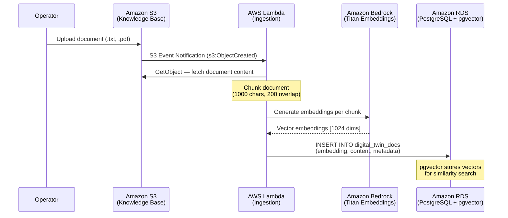
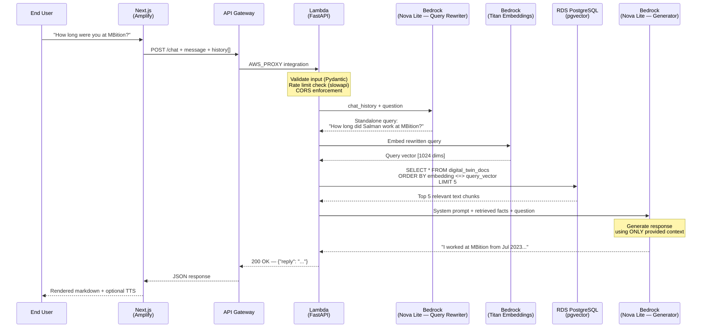

<h1 align="center">AI Digital Twin</h1>

<p align="center">
  <strong>A production-grade, serverless RAG architecture on AWS built with Terraform, FastAPI, LangChain, and Next.js</strong>
</p>

<p align="center">
  
  
  
  
  
  
  
</p>

<p align="center">
  <a href="#overview">Overview</a> •
  <a href="#key-features">Key Features</a> •
  <a href="#architecture">Architecture</a> •
  <a href="#the-zero-cost-hack">Zero-Cost Hack</a> •
  <a href="#project-structure">Project Structure</a> •
  <a href="#getting-started">Getting Started</a>
</p>

---

## Overview

**AI Digital Twin** is a fully serverless conversational AI system that acts as a personalized digital avatar. It is capable of answering detailed questions about a professional's background, experience, and skills in real-time. 

The system implements a robust **Retrieval-Augmented Generation (RAG)** pipeline backed by Amazon Bedrock, PostgreSQL with pgvector, and a hardened FastAPI backend. All infrastructure is deployed and managed deterministically via Terraform. The frontend is a highly responsive Next.js application hosted on AWS Amplify, featuring a ChatGPT-style chat interface with integrated voice capabilities.

**Live Demo**: [Feature Environment (Amplify)](https://feature-aws-enterprise-migration.d5kicq590mwz3.amplifyapp.com)

---

## Key Features

- **Serverless RAG Pipeline**: Combines Amazon Bedrock's Foundation Models (Titan Embeddings V2 & Nova Lite) with PostgreSQL (pgvector) for accurate, hallucination-free responses based strictly on ingested documents.
- **Strictly $0.00/Month Baseline**: Implements an advanced architectural workaround to decouple VPC Endpoints, achieving enterprise-grade security on a pure Free Tier budget.
- **Infrastructure as Code (IaC)**: 100% of the AWS infrastructure is codified in Terraform, allowing for reproducible and automated deployments.
- **Event-Driven Data Ingestion**: Simply uploading a PDF or Text file to an S3 bucket automatically triggers an asynchronous Lambda pipeline that chunks, embeds, and stores the knowledge in the database.
- **History-Aware Conversations**: Employs an LLM-driven query rewriting step that maintains context across long conversational threads.
- **Hardened Security**: Features rate limiting, payload sanitization, AWS Secrets Manager integration, and IAM Least Privilege policies.

---

## Architecture


### The Zero-Cost Hack

Best practice dictates placing Lambda functions and Databases inside **Private Subnets** with **VPC Endpoints** (PrivateLink) to securely connect to AWS services without internet exposure. However, VPC Endpoints carry a flat fee of ~$0.01/hr per endpoint, resulting in a strict baseline cost of **$1.92/day** ($58/month), defeating the goal of a hobby project.

To achieve a **$0.00/month** baseline, this architecture implements a workaround:
1. **Destroyed VPC Endpoints**: Eliminated Bedrock, Secrets Manager, X-Ray, and CloudWatch Endpoints.
2. **Exposed the Private Subnets**: Retained Private Subnets to prevent AWS ENI locking bugs, but attached an Internet Gateway route.
3. **Public RDS Endpoint**: Enabled `publicly_accessible = true` on the PostgreSQL instance, secured by a complex AWS Secrets Manager generated password to prevent brute-force attacks.
4. **Decoupled Compute**: Removed the VPC configuration from the Lambda functions. They now execute on the free public AWS managed network, accessing Bedrock via public AWS APIs and connecting to the RDS database via its public IP.

This bypasses all AWS baseline networking charges while keeping the AI application fully functional.

<details>
<summary><strong>View Detailed Sequence Diagrams</strong></summary>

#### Data Ingestion Pipeline

Documents uploaded to the S3 knowledge base bucket are automatically processed by an event-driven ingestion pipeline:



#### Query Pipeline (RAG Flow)

Every chat request follows a multi-step retrieval-augmented generation flow with history-aware query rewriting:


</details>

---

## Project Structure

```text
digital-twin/
├── backend/                   # FastAPI Python Application
│   ├── main.py                # Core API routes and rate limiting
│   ├── rag_pipeline.py        # LangChain logic, Prompts, and Bedrock integration
│   ├── ingestion.py           # S3 event listener for document ingestion
│   ├── database.py            # PostgreSQL connection pooling and queries
│   └── requirements.txt       # Python dependencies
├── frontend/                  # Next.js Application
│   ├── src/app/               # Application routes (page.tsx, layout.tsx)
│   ├── src/components/        # Reusable React components (ChatWindow, Sidebar)
│   ├── src/lib/               # API clients and utility functions
│   └── package.json           # Node dependencies
└── terraform/                 # Infrastructure as Code
    ├── main.tf                # Provider definitions
    ├── vpc.tf                 # Networking configurations
    ├── rds.tf                 # PostgreSQL instance provisioning
    ├── lambda.tf              # Compute layer definitions
    ├── api.tf                 # API Gateway routing
    └── iam.tf                 # Security policies and roles
```

---

## Getting Started

### Prerequisites

- An AWS Account with Administrator access.
- `Terraform` (>= 1.5.0)
- `Python` (>= 3.12)
- `Node.js` (>= 18)
- `AWS CLI` configured with appropriate credentials.

### 1. Provision Infrastructure

Navigate to the terraform directory and apply the configuration to provision the AWS resources.

```bash
cd terraform
terraform init
terraform apply -auto-approve
```

### 2. Deploy Backend Application

Package the FastAPI backend into a deployment artifact and update the Lambda function.

```bash
cd backend
# Create deployment package
pip install -r requirements.txt -t package/
cp *.py package/
cd package && zip -r ../deployment.zip . && cd ..

# Update AWS Lambda
aws lambda update-function-code --function-name digital-twin-api --zip-file fileb://deployment.zip
```

### 3. Run Frontend Locally

Configure the frontend to point to your newly deployed API Gateway endpoint, and start the development server.

```bash
cd frontend
npm install
# Add your API Gateway URL to a .env.local file
echo "NEXT_PUBLIC_API_URL=$(cd ../terraform && terraform output -raw api_gateway_url)" > .env.local
npm run dev
```

---

## Observability

The architecture integrates deeply with AWS native observability tools:
- **Amazon CloudWatch**: Captures structured JSON logs from the Lambda functions for easy parsing and debugging.
- **AWS X-Ray**: Provides end-to-end distributed tracing to identify performance bottlenecks in the RAG pipeline.
- **AWS CloudTrail**: Audits all API calls made within the AWS account for compliance and security monitoring.

## License

This project is licensed under the MIT License.
