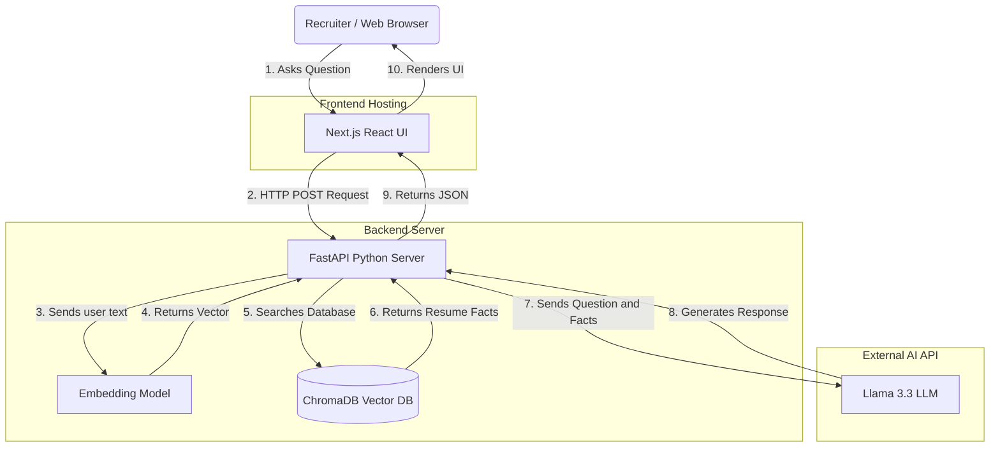

# Digital Twin Portfolio

Welcome to the repository for **SALMAN.DEV**, the personal portfolio and AI Digital Twin for Muhammad Salman, a Senior Infrastructure Consultant and 6x AWS Certified professional.

This project is a modern, decoupled web application that combines a stunning Next.js frontend with a powerful, RAG-enabled Python AI backend.

## Architecture

The application is split into two distinct parts:

1. **Frontend (`/frontend`)**: A React/Next.js application responsible for the beautiful, animated user interface and the Chatbot UI. It features Markdown rendering, Speech-to-Text, and Text-to-Speech capabilities.
2. **Backend (`/backend`)**: A Python/FastAPI application that serves as the "AI Brain". It utilizes Langchain, a local ChromaDB vector database containing Salman's resume data, and the Groq LLM API to process natural language queries and respond as Salman's digital twin.

## Deployment

This project is configured for a zero-cost, enterprise-grade deployment:
* **Frontend**: Hosted on [Vercel](https://vercel.com) for global CDN edge caching and instant CI/CD.
* **Backend**: Hosted on [Render](https://render.com) using the included `render.yaml` configuration for seamless Web Service deployment.

## Local Development

To run this project locally, you will need to start both the frontend and the backend servers.

### 1. Start the AI Backend
```bash
cd backend
python3 -m venv venv
source venv/bin/activate
pip install -r requirements.txt

# Create a .env file and add your GROQ_API_KEY
echo "GROQ_API_KEY=your_api_key_here" > .env

# Start the FastAPI server
uvicorn main:app --host 0.0.0.0 --port 8000 --reload
```

### 2. Start the Frontend UI
```bash
cd frontend
npm install
npm run dev
```
Open `http://localhost:3000` in your browser. The frontend will automatically route chat requests to `http://localhost:8000`.

## Tech Stack
* **UI**: Next.js, React, Framer Motion, Vanilla CSS
* **AI Engine**: Langchain, HuggingFace Embeddings, Groq (Llama 3)
* **Vector DB**: ChromaDB
* **API**: FastAPI, Python

## System Design & Architecture Flow
The following diagram illustrates the complete RAG (Retrieval-Augmented Generation) workflow:


