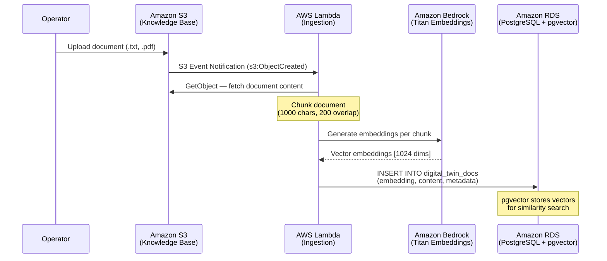
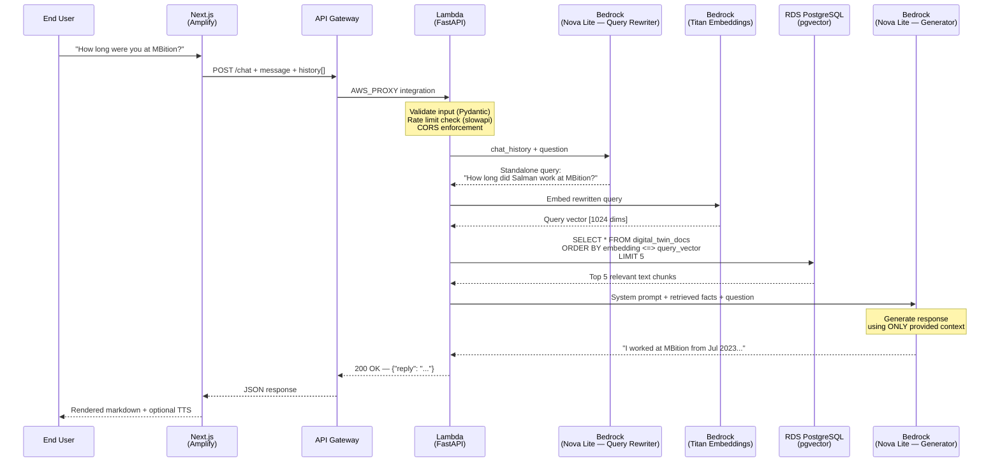

<h1 align="center">AI Digital Twin</h1>

<p align="center">
  <strong>A production-grade, serverless RAG architecture on AWS built with Terraform, FastAPI, LangChain, and Next.js</strong>
</p>

<p align="center">
  
  
  
  
  
  
</p>

<p align="center">
  <a href="#overview">Overview</a> •
  <a href="#key-features">Key Features</a> •
  <a href="#architecture">Architecture</a> •
  <a href="#enterprise-grade-security-architecture">Enterprise Security</a> •
  <a href="#project-structure">Project Structure</a> •
  <a href="#getting-started">Getting Started</a>
</p>

---

## Overview

**AI Digital Twin** is a fully serverless conversational AI system that acts as a personalized digital avatar. It is capable of answering detailed questions about a professional's background, experience, and skills in real-time.

The system implements a robust **Retrieval-Augmented Generation (RAG)** pipeline backed by Amazon Bedrock, PostgreSQL with pgvector, and a hardened FastAPI backend. All infrastructure is deployed and managed deterministically via Terraform. The frontend is a highly responsive Next.js application hosted on AWS Amplify, featuring a ChatGPT-style chat interface with integrated voice capabilities.

**Live Demo**: [Feature Environment (Amplify)](https://feature-aws-enterprise-migration.d5kicq590mwz3.amplifyapp.com)

---

## Key Features

- **Serverless RAG Pipeline**: Combines Amazon Bedrock's Foundation Models (Titan Embeddings V2 & Nova Lite) with PostgreSQL (pgvector) for accurate responses grounded strictly in ingested documents, minimizing hallucination.
- **Enterprise-Grade Security**: Implements a strict Zero-Trust network topology using AWS PrivateLink (VPC Endpoints) to ensure all database and AI API traffic never traverses the public internet.
- **Infrastructure as Code (IaC)**: 100% of the AWS infrastructure is codified in Terraform, allowing for reproducible and automated deployments.
- **Event-Driven Data Ingestion**: Simply uploading a PDF or Text file to an S3 bucket automatically triggers an asynchronous Lambda pipeline that chunks, embeds, and stores the knowledge in the database.
- **Automated CI/CD Pipeline**: Employs GitHub Actions to automatically build the Lambda packages and run `terraform plan` / `terraform apply` on every push to the deployment branch, using AWS OpenID Connect (OIDC) for passwordless, keyless deployments.
- **History-Aware Conversations**: Employs an LLM-driven query rewriting step that maintains context across long conversational threads.
- **Hardened Security**: Features rate limiting, payload sanitization, AWS Secrets Manager integration, and IAM Least Privilege policies.

---

## Architecture


### Enterprise-Grade Security Architecture

Best practice dictates placing Lambda functions and Databases inside **Private Subnets** with **VPC Endpoints** (PrivateLink) to securely connect to AWS services without internet exposure.

To achieve a **Production-Ready** baseline, this architecture implements the following enterprise patterns:
1. **Isolated Subnets**: The PostgreSQL database and Compute Lambdas reside strictly in Private Subnets with no Internet Gateway route, rendering them inaccessible from the public internet.
2. **AWS PrivateLink (VPC Endpoints)**: Secure, private tunnels are provisioned for Amazon Bedrock, AWS Secrets Manager, Amazon CloudWatch, and AWS X-Ray. API traffic to these services never traverses the public internet.
3. **Least Privilege IAM**: Every Lambda function executes under a tightly scoped IAM role, granting exact permissions (e.g., the Ingestion Lambda can generate Bedrock embeddings, but is explicitly denied access to the Bedrock LLM).
4. **Encrypted Secrets**: The database master password is auto-generated and managed by AWS Secrets Manager, keeping it out of Terraform state entirely. Lambda functions dynamically fetch this secret at runtime.

<details>
<summary><strong>View Detailed Sequence Diagrams</strong></summary>

#### Data Ingestion Pipeline

Documents uploaded to the S3 knowledge base bucket are automatically processed by an event-driven ingestion pipeline:



#### Query Pipeline (RAG Flow)

Every chat request follows a multi-step retrieval-augmented generation flow with history-aware query rewriting:


</details>

---

## Project Structure

```text
digital-twin/
├── lambdas/                        # All AWS Lambda source code lives here
│   ├── api/                        # Chat API Lambda (FastAPI)
│   │   ├── main.py                 # API routes, RAG chain, Secrets/DB access, rate limiting, CORS
│   │   ├── ingest.py               # Local one-off ingestion script (dev use)
│   │   ├── build.sh                # Builds the arm64 / manylinux2014 Lambda zip
│   │   ├── test_lambda.py          # Backend tests
│   │   └── requirements.txt        # Python dependencies (pinned for arm64)
│   └── ingestion/                  # Document-ingestion Lambda (S3-triggered)
│       ├── lambda_function.py      # Chunk + embed + store handler
│       ├── build.sh                # Builds the arm64 Lambda zip
│       └── requirements.txt
├── frontend/                       # Next.js app (JavaScript, hosted on AWS Amplify)
│   └── src/app/                    # App Router: page.js, layout.js, avatar/page.js, globals.css
├── data/                           # Knowledge-base source documents (synced to S3)
├── terraform/                      # Infrastructure as Code (references ../lambdas)
│   ├── provider.tf                 # Provider + S3/DynamoDB remote state backend
│   ├── vpc.tf                      # VPC, subnets, security groups, VPC endpoints (PrivateLink)
│   ├── rds.tf                      # PostgreSQL 16 + pgvector instance
│   ├── api.tf                      # API Lambda, API Gateway (HTTP API), EventBridge warm-up
│   ├── lambda.tf                   # Ingestion Lambda, deployment bucket, S3 trigger
│   ├── amplify.tf                  # Amplify frontend hosting
│   ├── iam.tf                      # Per-Lambda least-privilege execution roles
│   ├── oidc.tf                     # GitHub Actions OIDC provider + scoped deploy role
│   ├── cloudtrail.tf               # CloudTrail audit logging + root-usage alarm
│   ├── alarms.tf                   # CloudWatch alarms + SNS alerts
│   ├── s3.tf                       # Knowledge-base bucket
│   └── variables.tf / outputs.tf   # Input variables and outputs
├── scripts/                        # Dev helpers: start.sh, stop.sh, generate_diagram.py
└── .github/workflows/              # CI/CD: terraform.yml (build + deploy), data_sync.yml (S3 sync)
```

---

## Getting Started

### Prerequisites

- An AWS Account. **Administrator access is only required for the initial bootstrap** (creating the OIDC provider and remote-state backend); ongoing deployments run through the scoped GitHub Actions OIDC role.
- `Terraform` (>= 1.5.0)
- `Python` (>= 3.12)
- `Node.js` (>= 18)
- `AWS CLI` configured with appropriate credentials.

> In normal operation you don't run these steps by hand — pushing to the deployment branch triggers GitHub Actions, which builds the Lambda packages and runs `terraform apply` for you. The steps below are for a manual/local deploy.

### 1. Configure Variables

Copy the example variables file and fill in your values (`terraform.tfvars` is gitignored).

```bash
cd terraform
cp terraform.tfvars.example terraform.tfvars
# Edit terraform.tfvars: set github_token and alert_email
```

### 2. Build the Lambda Packages

The Lambdas run on **arm64 / manylinux2014**, so the dependencies must be built for that platform (not your host). The provided scripts handle this:

```bash
# From the repo root
(cd lambdas/api && ./build.sh)
(cd lambdas/ingestion && ./build.sh)
```

### 3. Provision Infrastructure

Terraform packages the built zips and deploys everything — VPC, RDS, both Lambdas, API Gateway, and Amplify.

```bash
cd terraform
terraform init
terraform apply
```

### 4. Run the Frontend Locally

Point the frontend at your deployed API Gateway endpoint and start the dev server.

```bash
cd frontend
npm install
# Pull the API URL straight from Terraform outputs
echo "NEXT_PUBLIC_API_URL=$(cd ../terraform && terraform output -raw api_gateway_url)" > .env.local
npm run dev
```

---

## Observability

The architecture integrates deeply with AWS native observability tools:
- **Amazon CloudWatch**: Captures structured JSON logs from the Lambda functions for easy parsing and debugging.
- **AWS X-Ray**: Provides end-to-end distributed tracing to identify performance bottlenecks in the RAG pipeline.
- **AWS CloudTrail**: Audits all API calls made within the AWS account for compliance and security monitoring.

## Developer Guide

### Pre-Commit Hooks
This repository enforces formatting and syntax checks locally before code is committed using `pre-commit`.

To install the hooks locally:
1. Install pre-commit: `brew install pre-commit` (macOS) or `pip install pre-commit`
2. Install the git hook scripts:
   ```bash
   pre-commit install
   ```
From now on, every time you run `git commit`, tools like `terraform fmt` and `terraform validate` will automatically execute to ensure your code is perfectly styled!

## License

This project is licensed under the MIT License.
