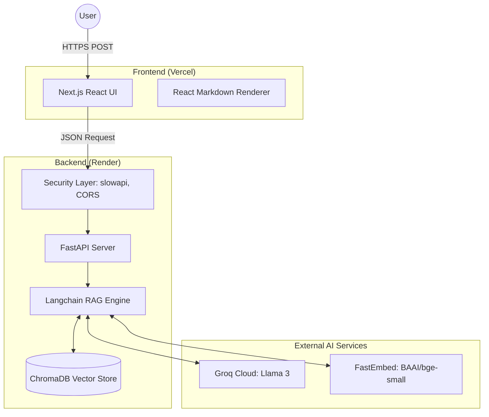
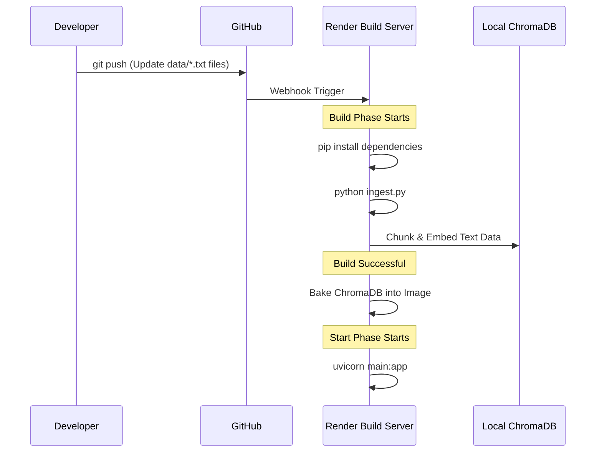
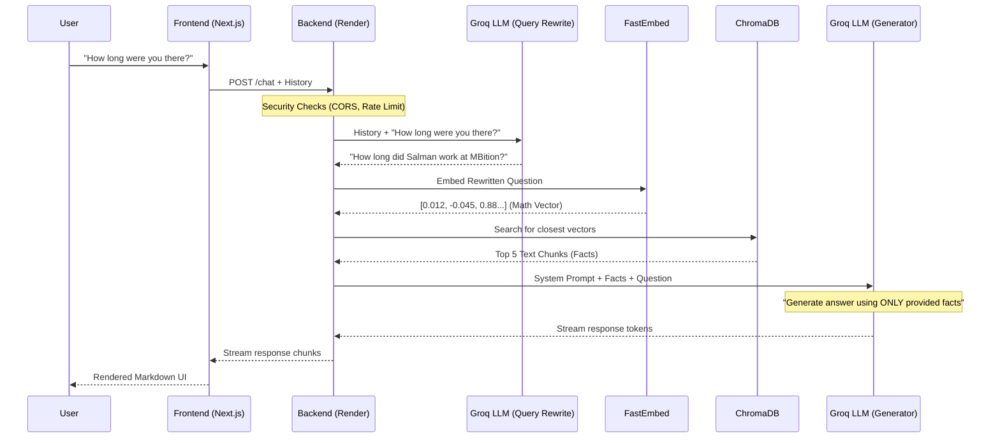

# 🤖 AI Digital Twin — Open Source RAG Architecture

Welcome to the **AI Digital Twin** project! This repository contains a production-ready Retrieval-Augmented Generation (RAG) system that powers a conversational AI avatar. 

This project demonstrates how to build, secure, and deploy a decoupled architecture using **Next.js (Frontend)** and **FastAPI + Langchain (Backend)**, running entirely on free-tier cloud providers (Vercel & Render) with zero hallucination guarantees.

---

## 🌟 Key Features

- **Strict Anti-Hallucination Guardrails**: The LLM is strictly constrained by a prompt system that forces it to refuse questions outside its factual database.
- **GitOps Data Pipeline**: Vector database (ChromaDB) generation is fully automated during the CI/CD build phase.
- **Enterprise-Grade Security**: Includes rate limiting, CORS whitelisting, prompt injection defenses, and strict payload validation.
- **"2 LLMs, 1 Embedding" Workflow**: Uses conversational history to rewrite queries before factual retrieval.

---

## 🏛️ System Architecture

The system is decoupled into two independent services:

1. **Frontend (Vercel)**: A static Next.js React application that provides the glassmorphism UI and Markdown-rendered chat interface.
2. **Backend API (Render)**: A Python FastAPI application that orchestrates the Langchain RAG pipeline.



---

## 🔄 The CI/CD Data Pipeline (The "Brain" Build)

To avoid bloating the Git repository with massive binary vector databases, the data ingestion process is fully automated during the **Render Build Phase**. 

**How it works:**
1. Maintainers update simple `.txt` files in the `data/` directory.
2. Code is pushed to GitHub.
3. Render catches the webhook and runs the build command (`pip install && python ingest.py`).
4. The Python script slices the text files, generates mathematical vectors using FastEmbed, and builds a fresh ChromaDB snapshot on the server.



---

## 💬 The Request Lifecycle (Step-by-Step RAG)

When a user asks a question, the system must translate natural language into a mathematical search, retrieve facts, and generate a conversational response.

**The "2 LLMs, 1 Embedding" Workflow:**



---

## 🛡️ Security Measures

This API is hardened against both traditional web vulnerabilities and AI-specific attack vectors:

- **CORS Restriction**: `ALLOWED_ORIGINS` strictly limits API access to the Vercel frontend.
- **Rate Limiting**: `slowapi` restricts users to 15 requests per minute per IP address.
- **Input Validation**: Pydantic models cap message lengths (1000 chars) and chat history size.
- **Prompt Injection Defense**: Explicit system directives prevent the LLM from revealing its instructions or assuming different personas.
- **Strict Ignorance Guardrail**: The LLM is instructed to explicitly say "I don't know" rather than hallucinate technologies or tools not found in the vector database.

---

## 🚀 Getting Started Locally

### 1. Backend Setup
```bash
cd backend
python -m venv venv
source venv/bin/activate
pip install -r requirements.txt

# Create .env based on .env.example
cp .env.example .env
# Edit .env and add your GROQ_API_KEY

# Ingest your personal data
python ingest.py

# Start the server
uvicorn main:app --reload
```

### 2. Frontend Setup
```bash
cd frontend
npm install
npm run dev
```

Visit `http://localhost:3000` to interact with your local Digital Twin.
