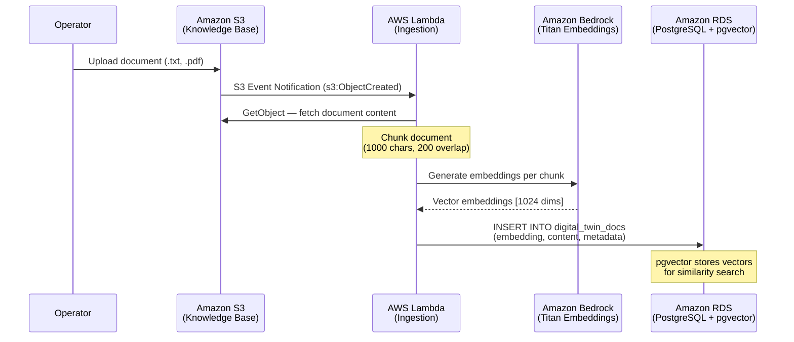
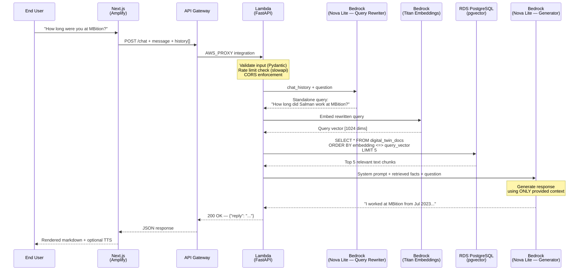

<h1 align="center">AI Digital Twin</h1>

<p align="center">
  <strong>A production-grade, serverless RAG architecture on AWS — built with Terraform, FastAPI, LangChain, and Next.js</strong>
</p>

<p align="center">
  <a href="#architecture">Architecture</a> •
  <a href="#features">Features</a> •
  <a href="#tech-stack">Tech Stack</a> •
  <a href="#getting-started">Getting Started</a> •
  <a href="#deployment">Deployment</a> •
  <a href="#security">Security</a> •
  <a href="#monitoring">Monitoring</a>
</p>

---

## Overview

**AI Digital Twin** is a fully serverless conversational AI system that creates a personalized avatar capable of answering questions about a professional's background, experience, and skills. The system implements a **Retrieval-Augmented Generation (RAG)** pipeline backed by Amazon Bedrock, PostgreSQL with pgvector, and a hardened FastAPI backend — all deployed and managed through Terraform.

The frontend is a responsive Next.js application hosted on AWS Amplify, featuring a portfolio view and a ChatGPT-style chat interface with voice input/output capabilities.

> **Live Demo**: [https://feature-aws-enterprise-migration.d5kicq590mwz3.amplifyapp.com](https://feature-aws-enterprise-migration.d5kicq590mwz3.amplifyapp.com)

---

## Architecture

### High-Level Architecture

```mermaid
graph TB
    subgraph "Client Layer"
        USER["👤 End User"]
        BROWSER["Browser<br/>(Next.js on Amplify)"]
    end

    subgraph "Edge Layer"
        APIGW["Amazon API Gateway<br/>(HTTP API)"]
    end

    subgraph "AWS Cloud — eu-central-1"
    
    subgraph VPC [Amazon VPC (10.0.0.0/16)]
        subgraph PUBLIC_SUBNETS [Public Subnets (10.0.1.0/24, 10.0.2.0/24)]
            IGW[Internet Gateway]
            RDS[(Amazon RDS<br/>PostgreSQL + pgvector)]
        end
    end
    
    subgraph COMPUTE [AWS Compute Network]
        LAMBDA_API["AWS Lambda<br/>(API — FastAPI/Mangum)<br/>Python 3.12 · ARM64"]
        LAMBDA_ING["AWS Lambda<br/>(Ingestion Pipeline)<br/>Python 3.12 · ARM64"]
    end

        subgraph "AI Services"
            BEDROCK_EMB["Amazon Bedrock<br/>Titan Embeddings V2"]
            BEDROCK_LLM["Amazon Bedrock<br/>Nova Lite (eu)"]
        end

        subgraph "Storage"
            S3_KB["Amazon S3<br/>(Knowledge Base)"]
            S3_DEPLOY["Amazon S3<br/>(Deployment Artifacts)"]
        end

        subgraph "Security & Secrets"
            SM["AWS Secrets Manager<br/>(RDS Credentials)"]
        end

        subgraph "Observability"
            CW["Amazon CloudWatch<br/>(Logs + Alarms)"]
            XRAY["AWS X-Ray<br/>(Distributed Tracing)"]
            CT["AWS CloudTrail<br/>(API Audit Logs)"]
            SNS["Amazon SNS<br/>(Alert Notifications)"]
        end

        EB["Amazon EventBridge<br/>(Warm-Up Scheduler)"]
    end

    USER --> BROWSER
    BROWSER -->|"HTTPS POST /chat"| APIGW
    APIGW -->|"AWS_PROXY"| LAMBDA_API
    LAMBDA_API -->|"Port 5432"| RDS
    LAMBDA_API -->|"Public AWS API"| BEDROCK_EMB
    LAMBDA_API -->|"Public AWS API"| BEDROCK_LLM
    LAMBDA_API -->|"Public AWS API"| SM
    LAMBDA_API -->|"Public AWS API"| CW
    LAMBDA_API -->|"Public AWS API"| XRAY

    S3_KB -->|"S3 Event Notification"| LAMBDA_ING
    LAMBDA_ING -->|"Embed & Store"| BEDROCK_EMB
    LAMBDA_ING -->|"Port 5432"| RDS
    EB -->|"rate(5 min)"| LAMBDA_API

    CW -->|"Alarm Trigger"| SNS

    style APIGW fill:#FF9900,color:#232F3E,stroke:#FF9900
    style LAMBDA_API fill:#FF9900,color:#232F3E,stroke:#FF9900
    style LAMBDA_ING fill:#FF9900,color:#232F3E,stroke:#FF9900
    style RDS fill:#3B48CC,color:#fff,stroke:#3B48CC
    style S3_KB fill:#3F8624,color:#fff,stroke:#3F8624
    style S3_DEPLOY fill:#3F8624,color:#fff,stroke:#3F8624
    style BEDROCK_EMB fill:#8C4FFF,color:#fff,stroke:#8C4FFF
    style BEDROCK_LLM fill:#8C4FFF,color:#fff,stroke:#8C4FFF
    style SM fill:#DD344C,color:#fff,stroke:#DD344C
    style CW fill:#FF4F8B,color:#fff,stroke:#FF4F8B
    style XRAY fill:#FF4F8B,color:#fff,stroke:#FF4F8B
    style CT fill:#DD344C,color:#fff,stroke:#DD344C
    style SNS fill:#FF4F8B,color:#fff,stroke:#FF4F8B
    style EB fill:#FF4F8B,color:#fff,stroke:#FF4F8B
```

### Data Ingestion Pipeline

Documents uploaded to the S3 knowledge base bucket are automatically processed by an event-driven ingestion pipeline:



### Query Pipeline (RAG Flow)

Every chat request follows a multi-step retrieval-augmented generation flow with history-aware query rewriting:



---

## Features

| Category | Feature |
|----------|---------|
| **AI & RAG** | History-aware retrieval with multi-turn context rewriting |
| **AI & RAG** | Anti-hallucination guardrails — strict factual grounding with graceful refusal |
| **AI & RAG** | Prompt injection defense — system prompt hardened against persona hijacking |
| **Frontend** | Responsive portfolio with glassmorphism UI, dark/light mode, and 3D tilt effects |
| **Frontend** | ChatGPT-style conversational interface with markdown rendering |
| **Frontend** | Browser-native Speech-to-Text and Text-to-Speech |
| **Backend** | Singleton AI Engine with warm-start pattern — sub-second response on warm Lambda |
| **Backend** | Secrets Manager credential caching (15-min TTL) |
| **Backend** | Structured JSON logging for CloudWatch Logs Insights queries |
| **Infrastructure** | Fully serverless — zero idle cost, pay-per-request pricing |
| **Infrastructure** | Private VPC with no internet egress — all AWS calls via VPC Endpoints |
| **Infrastructure** | 100% Infrastructure as Code (Terraform) with remote S3 state and DynamoDB locking |
| **Observability** | CloudWatch Alarms → SNS email notifications for errors, throttles, and P99 latency |
| **Observability** | AWS X-Ray distributed tracing across API Gateway → Lambda → Bedrock |
| **Observability** | CloudTrail audit logging with root account usage detection |
| **Security** | Least-privilege IAM — separate roles per Lambda, scoped to exact resource ARNs |
| **Security** | Multi-layer rate limiting — API Gateway throttling + application-level slowapi |
| **Security** | Input validation with length caps, control character stripping, and history limits |

---

## Tech Stack

### Application

| Layer | Technology | Purpose |
|-------|-----------|---------|
| Frontend | **Next.js 16** / React 19 | Portfolio and chat UI |
| Frontend | **Framer Motion** | Animations and micro-interactions |
| Backend | **FastAPI** + **Mangum** | REST API running on AWS Lambda |
| Backend | **LangChain** + **langchain-aws** | RAG orchestration pipeline |
| AI Model | **Amazon Nova Lite** (via Bedrock) | Conversational response generation |
| Embeddings | **Amazon Titan Embeddings V2** (via Bedrock) | 1024-dim text-to-vector conversion |
| Vector DB | **PostgreSQL 16** + **pgvector** (via RDS) | Semantic similarity search |

### Infrastructure

| Service | Purpose |
|---------|---------|
| **AWS Lambda** (ARM64/Graviton) | Serverless compute for API + ingestion |
| **Amazon API Gateway** (HTTP API) | Request routing, CORS, throttling |
| **Amazon RDS** (PostgreSQL) | Managed relational database with pgvector |
| **Amazon S3** | Knowledge base storage + Lambda deployment artifacts |
| **Amazon Bedrock** | Managed foundation model inference |
| **AWS Secrets Manager** | Database credential management |
| **Amazon VPC** + VPC Endpoints | Network isolation with private AWS connectivity |
| **Amazon CloudWatch** | Logs, metrics, and alarms |
| **AWS X-Ray** | Distributed request tracing |
| **AWS CloudTrail** | API audit logging |
| **Amazon SNS** | Alarm notifications |
| **Amazon EventBridge** | Lambda warm-up scheduler (5-min interval) |
| **AWS Amplify** | Frontend hosting with CI/CD from GitHub |
| **Terraform** (>= 1.5) | Infrastructure as Code |

---

## Project Structure

```
digital-twin/
├── frontend/                          # Next.js application (Amplify-hosted)
│   ├── src/app/
│   │   ├── page.js                    # Portfolio landing page
│   │   ├── avatar/page.js             # Chat interface (Digital Twin UI)
│   │   ├── globals.css                # Design system (glassmorphism, themes)
│   │   └── layout.js                  # Root layout with SEO metadata
│   ├── next.config.mjs                # Security headers (HSTS, CSP, X-Frame)
│   └── .env.local                     # NEXT_PUBLIC_API_URL
│
├── backend/                           # Python backend (Lambda-deployed)
│   ├── main.py                        # FastAPI app — endpoints, AI engine, RAG chain
│   ├── ingest.py                      # Local data ingestion script (ChromaDB)
│   ├── build.sh                       # Lambda deployment package builder
│   ├── requirements.txt               # Pinned dependencies (ARM64 compatible)
│   └── api_lambda.zip                 # Built deployment artifact (~86 MB)
│
├── data/                              # Knowledge base source documents
│   ├── 01_professional_summary.txt
│   ├── 02_experience.txt
│   ├── 03_projects.txt
│   └── ...                            # 10 structured text files
│
├── terraform/                         # Infrastructure as Code
│   ├── provider.tf                    # AWS provider + S3 remote backend
│   ├── variables.tf                   # Input variable definitions
│   ├── terraform.tfvars               # Environment-specific values (gitignored)
│   ├── vpc.tf                         # VPC, subnets, security groups, VPC endpoints
│   ├── rds.tf                         # RDS PostgreSQL instance configuration
│   ├── s3.tf                          # Knowledge base S3 bucket
│   ├── iam.tf                         # IAM roles + least-privilege policies
│   ├── lambda.tf                      # Ingestion Lambda + deployment S3 bucket
│   ├── api.tf                         # API Lambda + API Gateway + EventBridge warmup
│   ├── alarms.tf                      # CloudWatch alarms + SNS topic
│   ├── cloudtrail.tf                  # CloudTrail + root usage detection
│   └── outputs.tf                     # Exported resource identifiers
│
├── tutorial.md                        # In-depth beginner tutorial (1200+ lines)
├── start.sh                           # Local dev startup script
└── stop.sh                            # Local dev shutdown script
```

---

## Getting Started

### Prerequisites

| Tool | Version | Installation |
|------|---------|-------------|
| Node.js | >= 18 | `brew install node` |
| Python | 3.12 | `brew install python@3.12` |
| AWS CLI | >= 2.x | `brew install awscli` |
| Terraform | >= 1.5 | `brew install terraform` |

### Local Development

```bash
# Clone the repository
git clone https://github.com/msalmansaeedch786/digital-twin.git
cd digital-twin

# Backend setup
cd backend
python3 -m venv .venv && source .venv/bin/activate
pip install -r requirements.txt
cp .env.example .env   # Configure DATABASE_URL

# Frontend setup
cd ../frontend
npm install
echo 'NEXT_PUBLIC_API_URL=http://localhost:8000' > .env.local

# Start both services
cd ..
./start.sh             # Launches backend (port 8000) + frontend (port 3000)
```

Visit **http://localhost:3000** to interact with the application locally.

---

## Deployment

### 1. Configure AWS Credentials

```bash
aws configure --profile digital-twin
# Region: eu-central-1
```

### 2. Initialize Terraform Backend (One-Time)

```bash
# Create S3 bucket for Terraform state
aws s3 mb s3://digital-twin-terraform-state-<ACCOUNT_ID> \
    --region eu-central-1 --profile digital-twin

# Create DynamoDB table for state locking
aws dynamodb create-table \
    --table-name digital-twin-terraform-locks \
    --attribute-definitions AttributeName=LockID,AttributeType=S \
    --key-schema AttributeName=LockID,KeyType=HASH \
    --billing-mode PAY_PER_REQUEST \
    --region eu-central-1 --profile digital-twin
```

### 3. Deploy Infrastructure

```bash
cd terraform

# Set your variables
cp terraform.tfvars.example terraform.tfvars
# Edit terraform.tfvars: amplify_domain, alert_email

terraform init
terraform plan
terraform apply
```

### 4. Build & Deploy Backend

```bash
cd backend
./build.sh              # Creates api_lambda.zip with ARM64 dependencies

cd ../terraform
terraform apply         # Uploads ZIP to S3 → updates Lambda function code
```

### 5. Deploy Frontend

Connect the repository to **AWS Amplify** via the AWS Console. Amplify auto-detects the Next.js build configuration and deploys on every push.

Set the environment variable in the Amplify Console:
```
NEXT_PUBLIC_API_URL = <api_gateway_url from terraform output>
```

### 6. Enable Bedrock Model Access

In the AWS Console → **Amazon Bedrock** → **Model access**:
- Enable **Amazon Titan Text Embeddings V2**
- Enable **Amazon Nova Lite**

---

## Security

This architecture implements defense-in-depth aligned with the **AWS Well-Architected Framework — Security Pillar**:

| Layer | Control | Implementation |
|-------|---------|---------------|
| **Network** | Private subnets | Lambda + RDS have zero internet access |
| **Network** | VPC Endpoints | All AWS API calls stay on the private AWS backbone |
| **Network** | Security Groups | Lambda egress scoped to RDS (5432) and VPC Endpoints (443) only |
| **Identity** | Separate IAM roles | One role per Lambda function — no shared permissions |
| **Identity** | Least privilege | Permissions scoped to exact resource ARNs — no wildcards |
| **Data** | Encryption at rest | RDS: KMS, S3: KMS (Bucket Keys enabled) |
| **Data** | Encryption in transit | RDS: RSA-4096 TLS certificate, API Gateway: HTTPS only |
| **Data** | Secrets Manager | Database credentials never in code, env vars, or Terraform state |
| **Application** | Input validation | Message ≤ 1000 chars, history ≤ 20 messages, control char stripping |
| **Application** | Rate limiting | API Gateway: 20 req/s + Lambda: 1 req/3s per IP |
| **Application** | CORS | Locked to specific Amplify domain — no wildcards, no credentials |
| **Application** | Docs disabled in prod | `/docs`, `/redoc`, `/openapi.json` endpoints are disabled |
| **Frontend** | Security headers | HSTS, X-Frame-Options: DENY, X-Content-Type-Options: nosniff |
| **AI** | Prompt hardening | System prompt defends against injection, persona hijacking, and data extraction |
| **Audit** | CloudTrail | All management + data events logged to encrypted S3 with log file validation |
| **Audit** | Root account alarm | Instant SNS alert on any root account activity |

---

## Monitoring

### CloudWatch Alarms

| Alarm | Threshold | Notification |
|-------|-----------|-------------|
| API Lambda Errors | ≥ 5 errors / 5 min | SNS → Email |
| API Lambda Throttles | ≥ 10 throttles / 5 min | SNS → Email |
| API Lambda P99 Duration | > 25,000 ms | SNS → Email |
| RDS CPU Utilization | > 80% for 10 min | SNS → Email |
| RDS Connection Count | > 80 connections | SNS → Email |
| RDS Free Storage | < 5 GB | SNS → Email |
| Root Account Usage | ≥ 1 event | SNS → Email |

### Tracing

AWS X-Ray provides end-to-end request traces across API Gateway → Lambda → Bedrock → RDS, enabling identification of latency bottlenecks at each integration point.

### Logging

All Lambda functions emit structured JSON logs to CloudWatch, enabling queries via CloudWatch Logs Insights:

```sql
filter level = "ERROR"
| stats count(*) as error_count by function
| sort error_count desc
```

---

## Terraform Outputs

After `terraform apply`, the following values are exported:

| Output | Description |
|--------|------------|
| `api_gateway_url` | HTTPS endpoint for the backend API |
| `rds_endpoint` | PostgreSQL connection endpoint |
| `rds_secret_arn` | Secrets Manager ARN for database credentials |
| `s3_bucket_name` | Knowledge base S3 bucket name |
| `sns_alerts_topic_arn` | SNS topic for alarm notifications |
| `vpc_id` | VPC identifier |
| `cloudtrail_bucket` | S3 bucket storing audit logs |

---

## Documentation

For a comprehensive, line-by-line explanation of every file, technology, and AWS service used in this project, see **[tutorial.md](tutorial.md)** — a 1200+ line beginner-friendly walkthrough covering:

- Every AWS service explained with analogies
- Backend code walkthrough (main.py)
- End-to-end message flow traced through all components
- Security measures at every layer
- Local development and deployment guides
- Common problems and solutions

---

## License

This project is licensed under the MIT License. See [LICENSE](LICENSE) for details.
