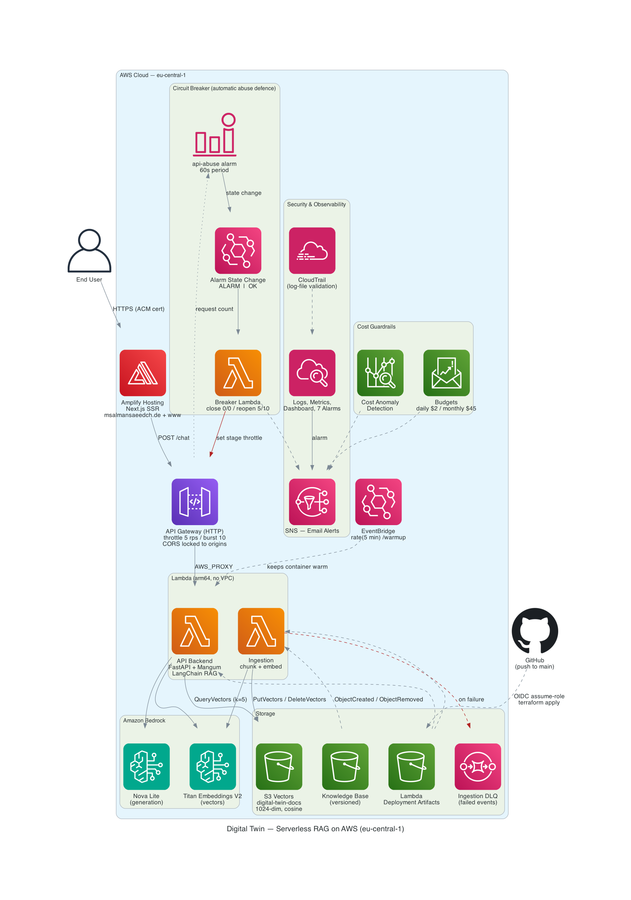
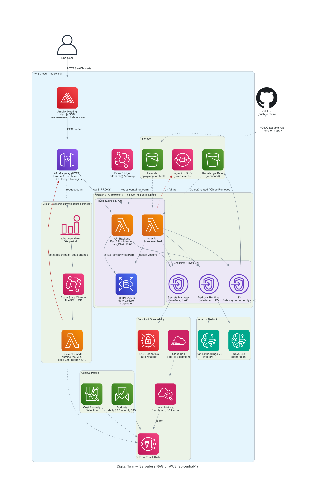
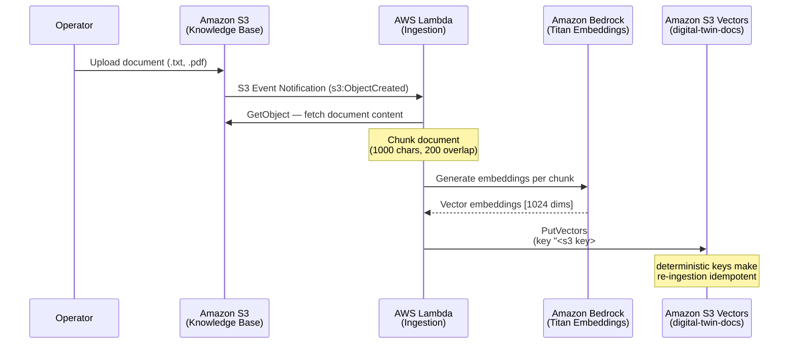
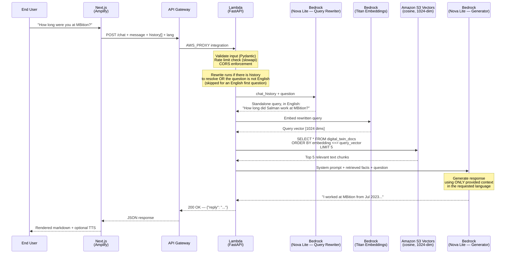

<h1 align="center">AI Digital Twin</h1>

<p align="center">
  <strong>A production-grade, serverless RAG architecture on AWS built with Terraform, FastAPI, LangChain, and Next.js</strong>
</p>

<p align="center">
  
  
  
  
  
  
</p>

<p align="center">
  <a href="#overview">Overview</a> •
  <a href="#key-features">Key Features</a> •
  <a href="#architecture">Architecture</a> •
  <a href="#enterprise-grade-security-architecture">Enterprise Security</a> •
  <a href="#project-structure">Project Structure</a> •
  <a href="#getting-started">Getting Started</a>
</p>

---

## Overview

**AI Digital Twin** is a fully serverless conversational AI system that acts as a personalized digital avatar. It is capable of answering detailed questions about a professional's background, experience, and skills in real-time.

The system implements a robust **Retrieval-Augmented Generation (RAG)** pipeline backed by Amazon Bedrock, Amazon S3 Vectors, and a hardened FastAPI backend. All infrastructure is deployed and managed deterministically via Terraform. The frontend is a highly responsive Next.js application hosted on AWS Amplify, featuring a ChatGPT-style chat interface with integrated voice capabilities.

**Live Demo**: [msalmansaeedch.de](https://msalmansaeedch.de)

---

## Key Features

- **Serverless RAG Pipeline**: Combines Amazon Bedrock's Foundation Models (Titan Embeddings V2 & Nova Lite) with **Amazon S3 Vectors** for accurate responses grounded strictly in ingested documents, minimizing hallucination. No database and no VPC: every component is serverless and billed per request.
- **IAM-Scoped Access, No Network Perimeter**: Every component authenticates with its own least-privilege IAM role rather than relying on network isolation. The API Lambda holds read-only access to the vector index and cannot write to it; ingestion can write but never serves traffic.
- **Infrastructure as Code (IaC)**: 100% of the AWS infrastructure is codified in Terraform, allowing for reproducible and automated deployments.
- **Event-Driven Data Ingestion**: Simply uploading a PDF or Text file to an S3 bucket automatically triggers an asynchronous Lambda pipeline that chunks, embeds, and stores the knowledge in the database.
- **Automated CI/CD Pipeline**: GitHub Actions builds the Lambda packages and runs `terraform plan` / `terraform apply` on every push to the deployment branch, using AWS OpenID Connect (OIDC) for passwordless, keyless deployments. Every change is gated on a bundle-contents check, an integration test against real S3 Vectors, and — after deploy — a 16-question retrieval comparison against a recorded baseline. A scheduled daily plan reports infrastructure drift.
- **History-Aware Conversations**: Employs an LLM-driven query rewriting step that maintains context across long conversational threads.
- **Bilingual (English / German)**: The portfolio and the twin are served under locale-segmented routes (`/en`, `/de`), both statically prerendered and edge-cached, with canonical + `hreflang` metadata and a generated `sitemap.xml`. The knowledge base stays English and a request carries a `lang` field. Language moves in both directions around retrieval: a non-English question is rewritten into English *before* embedding, so it matches the English vectors properly, and the answer is then generated back in the reader's language. An English question with no history skips that rewrite and pays no extra latency.
- **Hardened Security**: Features rate limiting, payload sanitization, and IAM Least Privilege policies. There are no application credentials anywhere in the stack — no database password, no connection string, nothing to rotate or leak.

---

## Architecture



<details>
<summary><b>What this looked like before 5 October 2026 — and why it changed</b></summary>

<br>



The earlier design put a PostgreSQL database inside a private VPC, with three PrivateLink endpoints so the Lambdas could reach Bedrock, Secrets Manager and S3 without touching the public internet. Textbook network isolation.

What changed, and what it cost:

| | Before | After |
|---|---|---|
| Vector store | RDS PostgreSQL 16 + `pgvector` | Amazon S3 Vectors |
| Network | VPC, 2 private subnets, 3 endpoints | none — no VPC at all |
| Credentials | DB password in Secrets Manager | none, IAM roles only |
| Alarms | 10 (3 of them watching RDS) | 7 |
| Daily cost | **$1.14** ($1.12 of it RDS + VPC) | the 98% removed |
| Vector search | 12.6 ms | 64 ms |
| End-to-end answer | 1057 ms | 1107 ms |

The second-to-last row is why the change is interesting, and the last row is why it was safe. S3 Vectors is genuinely ~5× slower at the search step — but search was **1.2% of the time a visitor waits**, so the whole trade costs about **50 ms on a ~1.1 s answer** while removing 98% of the bill.

It was verified rather than assumed: a 16-question suite in both locales was recorded *before* any change and re-run twice afterwards, scoring identically each time (46/46 facts retrieved, 6/6 invented-fact traps avoided). See [`scripts/eval/`](scripts/eval/) and the committed runs in [`scripts/eval/runs/`](scripts/eval/runs/).

</details>

### Enterprise-Grade Security Architecture

This stack previously ran a PostgreSQL database in private subnets reached over PrivateLink. That was textbook network isolation, and it was also **97.8% of the bill**: measured over a month, the VPC interface endpoints cost $19.37 and RDS $18.35, while Bedrock — the actual AI — cost **$0.00**. Those two line items were one decision, because the endpoints existed only so a VPC-attached Lambda could reach Bedrock and Secrets Manager, and the Lambda was in the VPC only to reach the database.

Moving the vector store to **Amazon S3 Vectors** removed the database, which removed the reason for the VPC, which removed the endpoints. The security model shifted from *network perimeter* to *identity*, and the measured cost of retrieval latency was **+50 ms on a ~1.1 s request**.

The patterns this architecture implements now:
1. **No Credentials Anywhere**: There is no database, so there is no connection string, no master password and no secret to rotate, cache or leak. Every call is signed with the function's own IAM role. The Secrets Manager integration was deleted along with the database it existed to serve.
2. **Least Privilege IAM, Verified Not Assumed**: Each Lambda runs under a tightly scoped role — the ingestion Lambda's `bedrock:InvokeModel` is scoped to the embedding model ARN alone so it cannot reach the LLM, and the API Lambda holds read-only access to the vector index (`QueryVectors`/`GetVectors`) so a compromised request path cannot write to or enumerate the knowledge base. These grants are exercised as the role that holds them, because an admin-credentialed test cannot prove a least-privilege policy is sufficient.
3. **Reproducible, Not Backed Up**: Every vector is derived data, regenerated from `data/` by a single ingestion run. There is no backup to restore and no snapshot to pay for, because the source of truth is version-controlled text.
4. **Retrieval Regression Suite**: The failure that matters in a RAG system is silent — if retrieval returns nothing, the model answers from its own priors and sounds entirely confident. A committed suite captures answers to 16 questions in both locales and diffs two runs, including three questions with no answer in the knowledge base. A CloudWatch alarm on zero-document answers covers it in production.
5. **Automatic Circuit Breaker**: A CloudWatch alarm on the API Gateway request count (60-second periods) fires an EventBridge rule into a dedicated breaker Lambda, which sets the stage throttle to `0/0` — every request is then rejected at the front door for free, before Lambda or Bedrock can be billed. A second rule fires when the alarm returns to `OK` and restores the normal `5 req/s` limit, so the API self-heals once a flood stops. This has absorbed live floods of >300,000 requests for a few cents.
6. **Cost Guardrails**: Daily and monthly AWS Budgets plus Cost Anomaly Detection publish to SNS, so unexpected spend is caught even if it never trips a technical alarm.

<details>
<summary><strong>View Detailed Sequence Diagrams</strong></summary>

#### Data Ingestion Pipeline

Documents uploaded to the S3 knowledge base bucket are automatically processed by an event-driven ingestion pipeline:


```mermaid
sequenceDiagram
    participant User as Operator
    participant S3 as Amazon S3<br/>(Knowledge Base)
    participant Lambda as AWS Lambda<br/>(Ingestion)
    participant Bedrock as Amazon Bedrock<br/>(Titan Embeddings)
    participant SV as Amazon S3 Vectors<br/>(digital-twin-docs)

    User->>S3: Upload document (.txt, .pdf)
    S3->>Lambda: S3 Event Notification (s3:ObjectCreated)
    Lambda->>S3: GetObject — fetch document content
    Note over Lambda: Chunk document<br/>(1000 chars, 200 overlap)
    Lambda->>Bedrock: Generate embeddings per chunk
    Bedrock-->>Lambda: Vector embeddings [1024 dims]
    Lambda->>SV: PutVectors<br/>(key "<s3 key>#<chunk>", embedding, text)
    Note over SV: deterministic keys make<br/>re-ingestion idempotent
```

#### Query Pipeline (RAG Flow)

Every chat request follows a multi-step retrieval-augmented generation flow with history-aware query rewriting:


```mermaid
sequenceDiagram
    participant User as End User
    participant FE as Next.js<br/>(Amplify)
    participant GW as API Gateway
    participant LB as Lambda<br/>(FastAPI)
    participant LLM1 as Bedrock<br/>(Nova Lite — Query Rewriter)
    participant EMB as Bedrock<br/>(Titan Embeddings)
    participant DB as Amazon S3 Vectors<br/>(cosine, 1024-dim)
    participant LLM2 as Bedrock<br/>(Nova Lite — Generator)

    User->>FE: "How long were you at MBition?"
    FE->>GW: POST /chat + message + history[] + lang
    GW->>LB: AWS_PROXY integration

    Note over LB: Validate input (Pydantic)<br/>Rate limit check (slowapi)<br/>CORS enforcement

    Note over LB: Rewrite runs if there is history<br/>to resolve OR the question is not English<br/>(skipped for an English first question)

    LB->>LLM1: chat_history + question
    LLM1-->>LB: Standalone query, in English:<br/>"How long did Salman work at MBition?"

    LB->>EMB: Embed rewritten query
    EMB-->>LB: Query vector [1024 dims]

    LB->>DB: SELECT * FROM digital_twin_docs<br/>ORDER BY embedding <=> query_vector<br/>LIMIT 5
    DB-->>LB: Top 5 relevant text chunks

    LB->>LLM2: System prompt + retrieved facts + question
    Note over LLM2: Generate response<br/>using ONLY provided context<br/>in the requested language

    LLM2-->>LB: "I worked at MBition from Jul 2023..."
    LB-->>GW: 200 OK — {"reply": "..."}
    GW-->>FE: JSON response
    FE-->>User: Rendered markdown + optional TTS
```
</details>

---

## Project Structure

```text
digital-twin/
├── lambdas/                        # All AWS Lambda source code lives here
│   ├── api/                        # Chat API Lambda (FastAPI)
│   │   ├── main.py                 # API routes, RAG chain, Secrets/DB access, rate limiting, CORS
│   │   ├── ingest.py               # Local one-off ingestion script (dev use)
│   │   ├── build.sh                # Builds the arm64 / manylinux2014 Lambda zip
│   │   ├── test_lambda.py          # Ad-hoc import check (not a pytest suite)
│   │   └── requirements.txt        # Python dependencies (pinned for arm64)
│   ├── ingestion/                  # Document-ingestion Lambda (S3-triggered)
│   │   ├── lambda_function.py      # Chunk + embed + store handler
│   │   ├── build.sh                # Builds the arm64 Lambda zip
│   │   └── requirements.txt
│   └── breaker/                    # Circuit-breaker Lambda (no build.sh: Terraform
│       └── lambda_function.py      #   packages this single file via archive_file)
├── frontend/                       # Next.js app (JavaScript, hosted on AWS Amplify)
│   ├── src/app/                    # App Router, locale-segmented
│   │   ├── [lang]/                 # layout.js (root layout), page.js + portfolio-client.js,
│   │   │                           #   avatar/page.js + avatar-client.js
│   │   ├── dictionaries/           # en.json / de.json + locales.js (no-JSON helpers)
│   │   ├── seo.js                  # canonical + hreflang, derived from LOCALES
│   │   ├── sitemap.js / robots.js  # generated metadata routes
│   │   ├── lang-hint.js            # "also available in German" banner
│   │   ├── page.js                 # in-app redirect / -> /en (Amplify 301s at the edge)
│   │   └── globals.css
│   └── tests/                      # Playwright browser tests (i18n, chat, locale sweep)
├── data/                           # Knowledge-base source documents (synced to S3)
├── terraform/                      # Infrastructure as Code (references ../lambdas)
│   ├── provider.tf                 # Provider + S3/DynamoDB remote state backend
│   ├── s3vectors.tf                # S3 Vectors bucket + index (1024-dim, cosine)
│   ├── api.tf                      # API Lambda, API Gateway (HTTP API), EventBridge warm-up
│   ├── lambda.tf                   # Ingestion Lambda, deployment bucket, S3 trigger
│   ├── amplify.tf                  # Amplify frontend hosting
│   ├── iam.tf                      # Per-Lambda least-privilege execution roles
│   ├── oidc.tf                     # GitHub Actions OIDC provider + scoped deploy role
│   ├── breaker.tf                  # Circuit-breaker Lambda + EventBridge alarm rules
│   ├── cloudtrail.tf               # CloudTrail audit logging + root-usage alarm
│   ├── alarms.tf                   # CloudWatch alarms, budgets, cost anomaly detection
│   ├── dashboard.tf                # CloudWatch ops dashboard
│   ├── s3.tf                       # Knowledge-base bucket
│   └── variables.tf / outputs.tf   # Input variables and outputs
├── scripts/                        # Dev helpers
│   ├── start.sh / stop.sh          # Run backend + frontend locally
│   └── generate_diagram.py         # -> frontend/public/architecture.png
│                                   #    (architecture-before-s3vectors.png is kept for comparison)
└── .github/
    ├── dependabot.yml              # Actions/Terraform versions; pip + npm security-only
    └── workflows/
        ├── terraform.yml           # build, test, plan/apply, post-deploy retrieval check
        ├── frontend_tests.yml      # i18n + chat suites on frontend changes
        ├── drift.yml               # daily plan, alerts to SNS if reality diverges
        └── data_sync.yml           # data/ -> S3 knowledge base
```

---

## Getting Started

### Prerequisites

- An AWS Account. **Administrator access is only required for the initial bootstrap** (creating the OIDC provider and remote-state backend); ongoing deployments run through the scoped GitHub Actions OIDC role.
- `Terraform` (>= 1.5.0)
- `Python` **3.12** — the Lambda runtime. Not "3.12 or newer": the pinned dependencies have no wheels for 3.14 and `pydantic-core` 2.7.4 fails to build there, so a newer default interpreter produces a broken backend venv.
- `Node.js` (>= 20.9 — required by Next.js 16)
- `AWS CLI` configured with appropriate credentials.

> **Two ways to deploy — pick one:**
> - **Automated (recommended):** push to the deployment branch and GitHub Actions builds the Lambdas and runs `terraform apply` for you.
> - **Manual / local:** run the numbered steps below yourself. Steps 2–4 are only needed for a manual deploy.

### 1. Provide the secret

Terraform needs one sensitive input — `alert_email` (where CloudWatch alarms are sent). Amplify's access to the repo is handled by the **Amplify GitHub App** (installed once via the Amplify console), so no GitHub token is needed for normal runs.

**Automated (GitHub Actions):** add it as a **repository secret** under *GitHub → Settings → Secrets and variables → Actions*. The workflow reads it and passes it to Terraform via a `TF_VAR_*` environment variable — no `terraform.tfvars` file is involved (it's gitignored and never reaches CI):

| Repository secret | Maps to Terraform variable | Purpose |
|-------------------|----------------------------|---------|
| `TF_VAR_ALERT_EMAIL`  | `alert_email`  | Email address for CloudWatch alarm notifications |

> The workflow maps the secret to a `TF_VAR_*` env var, which Terraform reads as the matching variable ([terraform.yml](.github/workflows/terraform.yml)). Naming the secret `TF_VAR_<variable>` keeps it lined up 1:1 with the Terraform variable it feeds.

> **Recreating the Amplify app from scratch?** Only then is `github_token` needed: install the Amplify GitHub App on the repo and generate a one-time setup token (AWS doc: *Setting up Amplify access to GitHub repositories*), then pass it as `TF_VAR_github_token` / in `terraform.tfvars` for that single apply.

**Manual / local:** instead of repo secrets, create a `terraform.tfvars` from the example:

```bash
cd terraform
cp terraform.tfvars.example terraform.tfvars
# Edit terraform.tfvars: set alert_email
```

### 2. Build the Lambda Packages

The Lambdas run on **arm64 / manylinux2014**, so the dependencies must be built for that platform (not your host). The provided scripts handle this:

```bash
# From the repo root
(cd lambdas/api && ./build.sh)
(cd lambdas/ingestion && ./build.sh)
```

### 3. Provision Infrastructure

Terraform packages the built zips and deploys everything — S3 Vectors, all three Lambdas, API Gateway, and Amplify. A cold rebuild may need **two** applies: the deploy role's `s3vectors` grant and the vector bucket are created in the same run, and IAM does not propagate in the milliseconds Terraform leaves between them.

```bash
cd terraform
terraform init
terraform apply
```

### 4. Run the Frontend Locally

Point the frontend at your deployed API Gateway endpoint and start the dev server.

> **A local backend now works against the real vector store.** This used to be impossible: RDS sat in private subnets with `publicly_accessible = false`, so a backend on your laptop could not reach the database and `/chat` failed on connection even though the process started. S3 Vectors is an IAM-authorised HTTPS API, so with AWS credentials and `VECTOR_BUCKET_NAME`/`VECTOR_INDEX_NAME` set, `uvicorn main:app` serves real grounded answers with no tunnel and no local Postgres. For a fully offline loop with no AWS at all, see [Running it all locally](#running-it-all-locally).

```bash
cd frontend
npm install
# Pull the API URL straight from Terraform outputs
echo "NEXT_PUBLIC_API_URL=$(cd ../terraform && terraform output -raw api_gateway_url)" > .env.local
npm run dev
```

---

## Observability

The architecture integrates deeply with AWS native observability tools:
- **Amazon CloudWatch**: Captures structured JSON logs from the Lambda functions for easy parsing and debugging, and drives a `digital-twin-ops` dashboard plus seven alarms covering API abuse, Lambda errors/throttles/p99 duration, ingestion DLQ depth, root-account usage, and ungrounded answers (retrieval returning zero documents). The three RDS alarms went with the database; the dashboard panel they occupied now charts ungrounded answers instead, which is the metric that actually distinguishes a healthy RAG system from one confidently inventing facts.
- **Per-request latency breakdown**: Every chat request logs `embed_ms`, `search_ms`, `generate_ms`, `rewrite_ms`, `chain_ms`, `docs_retrieved` and `lang` (`rewrite_ms` is 0 when the query rewrite was skipped), so Logs Insights can answer where the time actually goes rather than only reporting a total. Measured on warm requests, generation is ~65% of the chain, embedding ~9%, and the S3 Vectors search ~6% (64 ms median). That search step was 12.6 ms on pgvector — roughly 5x faster in isolation, and worth 1.2% of a request, which is the whole argument for having moved it. `docs_retrieved` also doubles as a grounding check: a sustained 0 means retrieval is returning nothing and answers are no longer grounded.
- **Traffic attribution**: The API Gateway access log records `userAgent` and `path`, and the chat log records `user_agent` and `origin`, so real browser traffic can be separated from scripted calls and uptime pings.
- **Amazon SNS**: Delivers every alarm, circuit-breaker action, budget threshold, and cost anomaly to email.
- **Amazon SQS**: A dead-letter queue captures ingestion events that fail all retries, so a bad document is visible rather than silently dropped.
- **AWS CloudTrail**: Audits all API calls made within the AWS account for compliance and security monitoring, with log-file validation enabled.

> X-Ray tracing was evaluated and deliberately removed: it requires its own interface VPC endpoint (~$9/month) which outweighed its value for this workload. Structured logs, alarms, and the dashboard remain the observability path.

## Developer Guide

### Pre-Commit Hooks
This repository enforces formatting and syntax checks locally before code is committed using `pre-commit`, and runs the full test suite in CI on every change — see [What CI enforces](CLAUDE.md#what-ci-enforces).

To install the hooks locally:
1. Install pre-commit: `brew install pre-commit` (macOS) or `pip install pre-commit`
2. Install the git hook scripts:
   ```bash
   pre-commit install
   ```
From now on, every time you run `git commit`, tools like `terraform fmt` and `terraform validate` will automatically execute to ensure your code is perfectly styled!

### Fully Local Development (no AWS)

The stack can run entirely offline — local Postgres with `pgvector` instead of S3 Vectors, Ollama instead of Bedrock, no credentials of any kind. Two switches select this: `AI_PROVIDER=ollama` and `VECTOR_STORE=pgvector`. Both default to the cloud path, so nothing about the deployed Lambda changes. S3 Vectors has no local emulator, which is the only reason `langchain-postgres` and `psycopg` still exist in the project at all — they live in `requirements-local.txt` and never enter the Lambda zip.

**1. Install the pieces**

```bash
brew install python@3.12 postgresql@17 pgvector
ollama pull bge-m3          # embeddings, 1024-dim like Titan v2
ollama pull llama3.1        # generation (4.9 GB) — see the note below on model choice
```

> **Homebrew quirk worth knowing:** `postgresql@17` keeps its files under `share/postgresql`, but the server and `pgvector` both look in `share/postgresql@17`. If `initdb` fails with `postgres.bki does not exist` or the server complains it cannot open `.../timezone`, link them across:
> ```bash
> CELLAR=/opt/homebrew/Cellar/postgresql@17/17.11
> for f in "$CELLAR"/share/postgresql/*; do
>   [ "$(basename "$f")" = extension ] || ln -sfn "$f" /opt/homebrew/share/postgresql@17/
> done
> ln -sfn "$CELLAR"/lib/postgresql/* /opt/homebrew/lib/postgresql@17/
> ```

**2. Create the database**

```bash
export PATH="/opt/homebrew/opt/postgresql@17/bin:$PATH"
initdb -D /opt/homebrew/var/postgresql@17 --encoding=UTF8 --locale=en_US.UTF-8
brew services start postgresql@17
createdb digitaltwin
psql -d digitaltwin -c "CREATE EXTENSION IF NOT EXISTS vector;"
```

**3. Configure and install**

```bash
cd lambdas/api
cp .env.example .env      # then uncomment the local-mode block. BOTH switches are
                          # required: AI_PROVIDER=ollama AND VECTOR_STORE=pgvector.
                          # Setting only the first is refused at startup — see below.
python3.12 -m venv venv
./venv/bin/pip install -r requirements.txt -r requirements-local.txt
```

`requirements-local.txt` holds `langchain-ollama` and is **not** installed by `build.sh`, so the Lambda zip is unaffected.

**4. Ingest and run**

```bash
set -a; . ./.env; set +a
VECTOR_STORE=pgvector ./venv/bin/python ingest.py # embeds data/ into local pgvector
./venv/bin/uvicorn main:app --port 8000 --reload
```

Point the frontend at it with `NEXT_PUBLIC_API_URL=http://localhost:8000` in `frontend/.env.local`.

> **Ingest with the same provider you serve with.** Vectors written by one embedding model are not searchable by another. Switching `AI_PROVIDER` means re-running `ingest.py` against a clean collection.
>
> ⚠️ **Titan v2 and bge-m3 are both 1024-dimensional**, which makes the mistake silent rather than loud: S3 Vectors accepts either, writes succeed, and retrieval compares questions embedded by one model against documents embedded by the other. Scores become meaningless and the twin answers from near-random chunks while sounding entirely normal. `AI_PROVIDER=ollama` with the default `VECTOR_STORE=s3vectors` is therefore **refused at startup** and before any ingest write. Local mode needs *both* switches: `AI_PROVIDER=ollama` **and** `VECTOR_STORE=pgvector`.

> **Why llama3.1 and not a bigger model.** qwen3.6:27b (17 GB) was pulled and benchmarked on an M5 Pro / 48 GB against the same two questions, both warm: **English 18.9s vs 5.2s, German 58.2s vs 2.5s** — 3.6x and 23x slower. German is the worst case because it runs the query rewrite *and* generation through a 27B model. Both answered correctly and both retrieved 5 documents; the larger model formats more neatly and its German reads better, but the RAG grounding supplies the facts and the model mostly chooses the phrasing. A minute per German question is not a usable loop, so llama3.1 is the default. Pull the larger model only to demo offline quality where speed does not matter.

### Checking it still works

```bash
./scripts/verify_local.sh
```

Ten prerequisite checks, then a real question with AWS credentials stripped from the environment. This path cannot be covered by CI — it needs Ollama and a local Postgres, neither of which belongs on a GitHub runner — so this script is the only thing between the capability and silent rot. It had been broken for a month before anyone noticed, because `main.py` never actually read `.env`.

### Frontend Tests

The bilingual routing and the chat input behave correctly only in a real browser, so they are covered by Playwright rather than static checks. Run them against a production build:

```bash
cd frontend
npm run build
npx next start -p 3100 &

npm run test:i18n        # locales, canonical/hreflang, language hint, toggle scroll
npm run test:chat        # Enter / Shift+Enter, reader name + initials, nav layout
npm run test:i18n:sweep  # prints every string identical in /en and /de
```

`test:chat` stubs the `/chat` endpoint, so it never calls Bedrock. The sweep is a report rather than a pass/fail: proper nouns (company names, dates, certification titles) are expected in its output, because they stay in the component so they cannot drift between languages.

First run needs the browser: `npx playwright install chromium`.

## License

This project is licensed under the MIT License.
